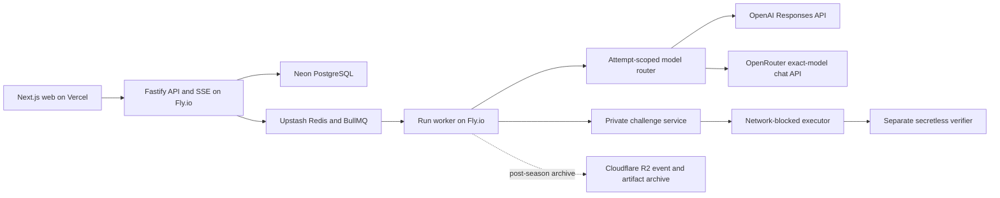

# Architecture

Prompt Gym is a TypeScript modular monolith with independently deployable web, API, and worker processes. The diagram is the hosted target; the alpha implementation status is called out below.

## Trust boundaries

- The browser submits commands and consumes ordered events; it is never authoritative for state, usage, cost, or verification.
- The API authenticates, applies limits, atomically records the prompt plus its hash-linked queued event, and exposes replayable SSE. Every downstream event, usage item, and verification retains explicit same-attempt `turn_id` lineage. Queued turn rows are immutable durable outbox records; an idempotent dispatcher sweep repairs missed BullMQ delivery.
- The worker resolves each queued turn from its persisted attempt and immutable arena, then routes it through a server-owned provider registry. Queue payloads never contain a browser-selected provider route.
- Each model/provider/endpoint/reasoning/tool/price/sandbox configuration has a separate content-addressed arena and leaderboard. Native provider token counts are never compared across models.
- The public worker receives only public instance state and opaque private references.
- The executor never receives verifier source or expected answers. The verifier receives only the frozen artifact and scoped fixture.
- Hidden assets are built from the private repository into pinned images whose digests are recorded on every attempt.

## Local and hosted adapters

The core depends on repository, queue, provider, and challenge-service interfaces. Local development uses in-memory repositories, inline jobs, a scripted provider, and the sibling challenge service. Hosted execution selects PostgreSQL, BullMQ, direct OpenAI for Terra, OpenRouter for validated practice profiles, and a private challenge-service adapter through environment configuration.

Implemented now: PostgreSQL durability, transactional queued turns, per-turn trajectory lineage, idempotent usage-and-score accounting, BullMQ recovery, worker-owned model/tool orchestration, replayable SSE, a frozen model catalog, direct OpenAI and endpoint-pinned OpenRouter adapters, and the private-service adapter. API and worker startup share a season anchor and full deployment digest. Local in-process cancellation is conservatively accounted; a process that does not own a remote paid call refuses to reopen it without acknowledgement. OpenRouter profiles stay practice-only until a durable cross-process provider-call reconciliation journal ships. The encrypted prompt vault, R2 post-season archival, and separately deployed Modal executor/verifier are deployment gates, not silently emulated by the local adapter. See [prompt-storage.md](prompt-storage.md) and [model-harnesses.md](model-harnesses.md).

## Benchmark evaluation target

Benchmark Lab reuses attempts, turns, provider usage, events, consent, and replay but adds immutable candidate artifacts, non-terminal benchmark evaluations, and a separate performance-band leaderboard. GPU work uses a dedicated `prompt-gym-gpu-evals` queue and private coordinator; it never shares the model-call worker's concurrency pool. The evaluator runs correctness before timing in a fresh, networkless, pinned GPU environment and independently reruns the selected artifact before finalization.

The public contracts and scripted page are implemented scaffolding. The GPU queue, `benchmark_evaluation` and `benchmark_leaderboard_entry` tables, artifact archive, environment attestation, and live evaluator are ranked-release gates. See [benchmark-lab.md](benchmark-lab.md) for the lifecycle and storage schema.

## Run state machine

`ready -> running -> awaiting_player -> solved | failed | budget_exhausted | cancelled | expired`

Every visible transition appends a sequenced, hash-linked event. SSE clients reconnect with `Last-Event-ID`. Disconnecting a browser does not cancel server work. Ambiguous provider failures are never blindly retried: the current alpha conservatively settles the reserved call budget and closes the attempt for operator reconciliation.
